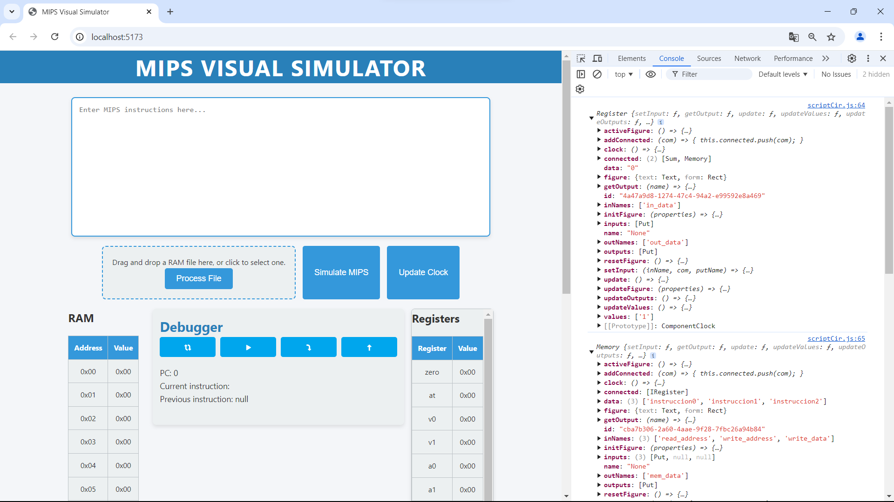

# **MIPS Visual Simulator**

**MIPS Visual Simulator** es una herramienta interactiva para simular y visualizar instrucciones de ensamblador MIPS. Este proyecto permite traducir instrucciones de MIPS a hexadecimal y viceversa, además de simular operaciones de registros, memoria, y ejecutar instrucciones paso a paso para una comprensión más profunda del funcionamiento de un procesador basado en MIPS.

---

## **Características principales**

- **Traducción de instrucciones:**
  - De MIPS a hexadecimal.
  - De hexadecimal a MIPS.
  
- **Simulación de instrucciones**:
  - Soporte para instrucciones aritméticas (`add`, `sub`, etc.).
  - Instrucciones de carga/almacenamiento (`lw`, `sw`, etc.).
  - Inmediatas (`addi`, `andi`, etc.).
  - Instrucciones de salto y ramas (`j`, `jal`, `beq`, etc.).

- **Carga de programas**:
  - Permite cargar programas en formato `.hex` arrastrando y soltando o seleccionando el archivo.

- **Interfaz interactiva**:
  - Representación de registros, memoria y tablas actualizadas en tiempo real.
  - Botones para simular, reiniciar y avanzar en la ejecución.

---

## **Tecnologías utilizadas**

- **Frontend**: HTML, CSS, JavaScript.
- **Backend**: Node.js.
- **Librerías adicionales**:
  - `FileReader` para cargar archivos.
  - Representación visual con tablas y áreas de texto interactivas.
